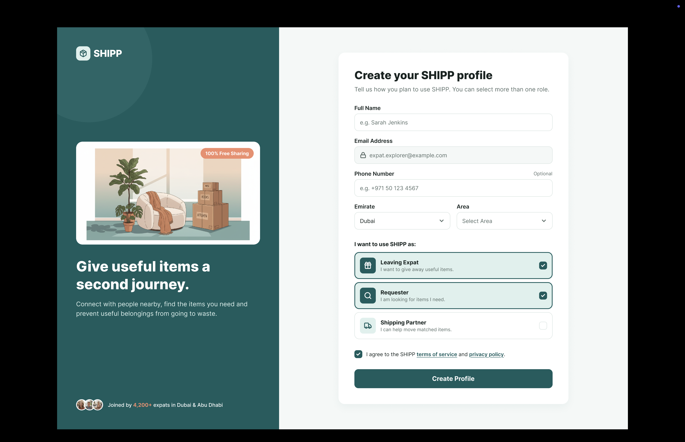
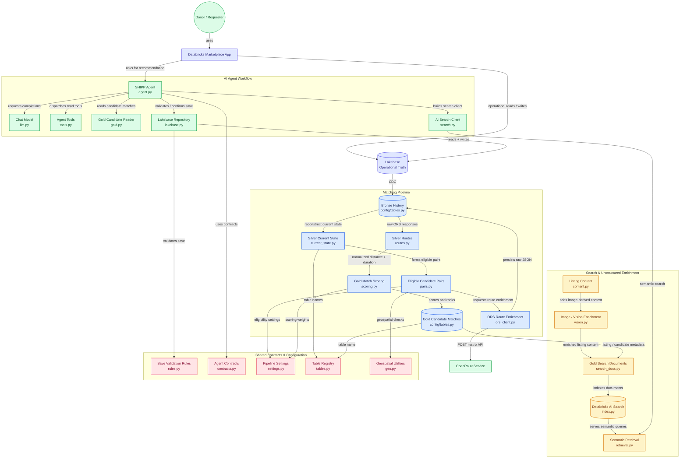

# shipp-marketplace
Databricks AI Data Engineering Capstone — multi-sided marketplace with data pipelines, RAG, AI agents, and a Databricks App.
-----------------------------------------------

## SHIPP Data Architecture

```text
Donor / Requester
        ↓
Databricks App
        ↓
Lakebase
(listings, requests, saved_items, agent_activity)
        ↓
CDF + Auto Loader
        ↓
Bronze
(raw changes, images, API responses)
        ↓
Silver
(clean listings, requests, image-derived content, routes)
        ↓
Eligible Listing–Request pairs
        ↓
POST /v2/matrix/driving-car
        ↓
gold_candidate_matches + gold_listing_search_docs
        ↓
AI Search + AI Agent
        ↓
Recommendation
        ↓
User approves save_item()
        ↓
Lakebase → CDF → gold_marketplace_metrics
        ↓
Databricks App shows “Saved”
```

# Landing Page Overview


# Login/signup Page



# Posting Page


# Review Page


-----------------------------------------------


## Matching Logic

```text
                    ELIGIBILITY (hard filters, Stage 6 — data_pipeline/silver/pairs.py)

Listing AVAILABLE, not expired        Request OPEN / MATCHES_AVAILABLE, need_by in future
Same category (normalised)            Listing available on/before need_by
Donor ≠ requester                     Straight-line distance ≤ 100 km
        ↓
POST /v2/matrix/driving-car  (Stage 7 — cached, rate-limited, raw JSON kept in Bronze)
        ↓
                    MATCH SCORE v1 (Stage 8 — data_pipeline/gold/scoring.py)

Route distance        × 50%     max(0, 1 − km / 50); 0 if no route (never invented)
Timing slack          × 30%     min(1, days between availability and need_by / 7)
Item condition        × 20%     NEW 1.0 · LIKE_NEW 0.9 · GOOD 0.75 · FAIR 0.5 · other 0.3
        ↓
gold_candidate_matches (top 10 per request)  →  AI Agent

v2 (after AI Search): distance 35% · semantic 35% · timing 20% · condition 10%
Weights live in one place: config/settings.py → SCORING
```

## Example Routing Enrichment Flow

```text
Lakebase
Listings + Requests
        ↓
CDF
        ↓
bronze_listing_changes + bronze_request_changes
        ↓
silver_listings + silver_requests
        ↓
Eligible Listing–Request pairs
        ↓
POST /v2/matrix/driving-car
        ↓
bronze_route_responses
(raw API JSON)
        ↓
silver_routes
(distance_km, duration_min)
        ↓
gold_candidate_matches
        ↓
AI Agent
```

## Repository Structure

```text
shipp-marketplace/
├── config/
│   ├── tables.py              ← every Unity Catalog table name (single registry)
│   └── settings.py            ← statuses, ORS settings, scoring weights
├── data_pipeline/             ← reusable, unit-tested functions; never writes tables
│   ├── common/                   geo.py, spark_io.py
│   ├── silver/                   current_state.py (delete-aware CDC), pairs.py, routes.py
│   ├── gold/                     scoring.py
│   ├── ingestion/                ors_client.py
│   └── quality/                  data_quality.py
├── notebooks/                 ← the ONLY writers of tables (one writer per table)
│   ├── common/shipp_silver_lib   bootstrap: sys.path + module reload + helpers
│   ├── validation/               00–04 checks
│   ├── development/              10, 11 Silver · 20 ORS smoke · 30 pairs · 31 ORS · 32 routes · 40 Gold
│   ├── delete/                   live CDC delete test
│   ├── pipeline/                 90 end-to-end runner
│   └── README_START_HERE.md      run order + rules
├── lakebase/                  ← operational DB: migrations 001–009, seeds, README
├── tests/unit/                ← pytest (local Spark) — runs in CI
├── .github/workflows/ci.yml   ← secret scan + ruff + pytest
├── rag/                       ← Stage 8–9: vision, search docs, AI Search, retrieval tool (see rag/README.md)
├── agent/                     ← next stage (not built yet)
├── workFlow/                  ← spec, diagrams, UI mocks
└── requirements.txt, requirements-dev.txt
```

**Rules:** secrets only in the Databricks secret scope `shipp` · no table name or weight hardcoded in a notebook ·
one writer per table · CDC logic changes only in `data_pipeline/silver/current_state.py` + its tests.


-----
### Repository Architecture

The diagram below maps the SHIPP end-to-end architecture to the implementation files in this repository.



