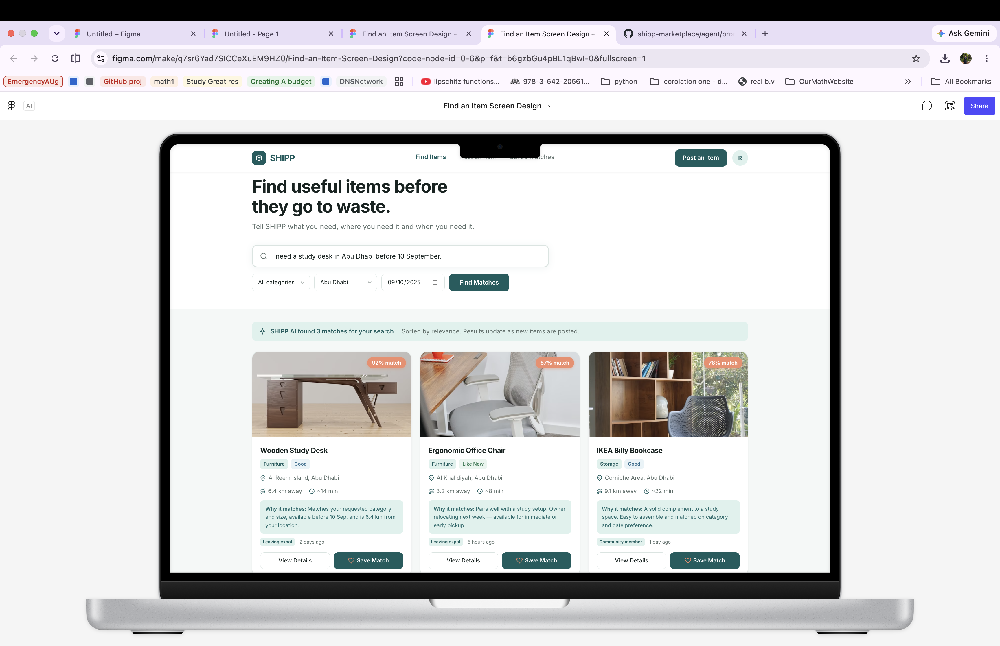
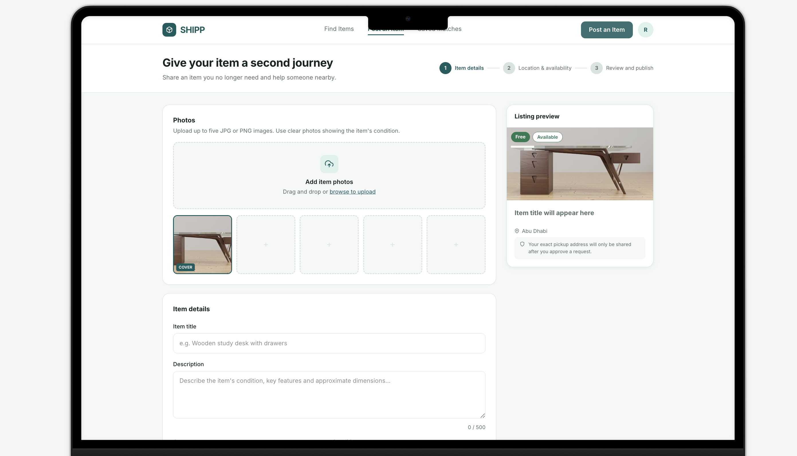
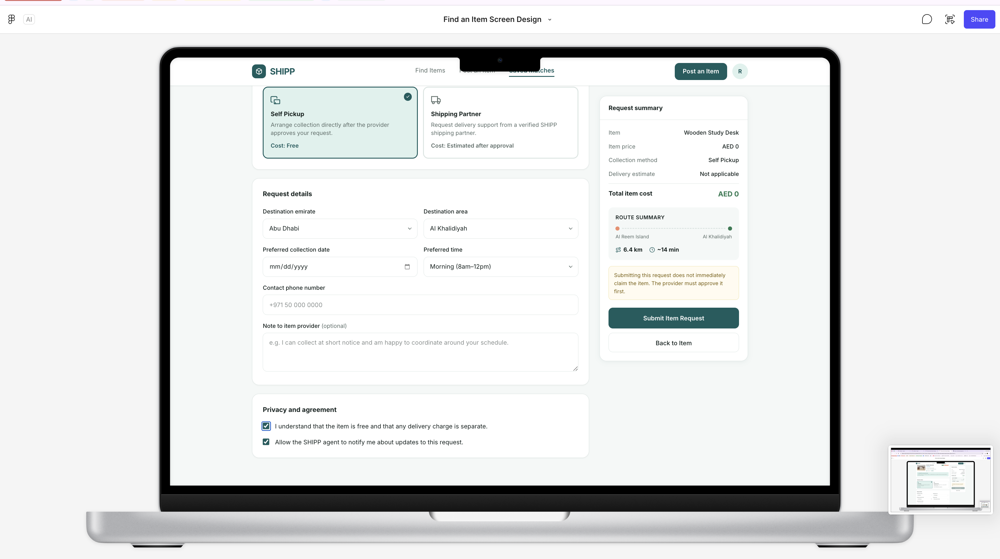

# shipp-marketplace
Databricks AI Data Engineering Capstone — multi-sided marketplace with data pipelines, RAG, AI agents, and a Databricks App.
-----------------------------------------------
3







-----------------------------------------------

## SHIPP Data Architecture

```text
Donor / Requester
        ↓
Databricks App
        ↓
Lakebase
(listings, requests, saved_items, agent_activity)
        ↓
CDF + Auto Loader
        ↓
Bronze
(raw changes, images, API responses)
        ↓
Silver
(clean listings, requests, image-derived content, routes)
        ↓
Eligible Listing–Request pairs
        ↓
POST /v2/matrix/driving-car
        ↓
gold_candidate_matches + gold_listing_search_docs
        ↓
AI Search + AI Agent
        ↓
Recommendation
        ↓
User approves save_item()
        ↓
Lakebase → CDF → gold_marketplace_metrics
        ↓
Databricks App shows “Saved”
```

## Matching Logic

```text
                    ELIGIBILITY CHECKS

Listing + Request
        ↓
Listing is AVAILABLE?
Category compatible?
Availability fits need_by date?
        ↓
Eligible Listing–Request pairs
        ↓
                    MATCH SCORE

Category compatibility     × 30%
Availability / date fit    × 25%
Route distance + duration  × 30%
Semantic relevance         × 15%
        ↓
gold_candidate_matches
        ↓
AI Agent
        ↓
"Best match is ..."
```

## Example Routing Enrichment Flow

```text
Lakebase
Listings + Requests
        ↓
CDF
        ↓
bronze_listing_changes + bronze_request_changes
        ↓
silver_listings + silver_requests
        ↓
Eligible Listing–Request pairs
        ↓
POST /v2/matrix/driving-car
        ↓
bronze_route_responses
(raw API JSON)
        ↓
silver_routes
(distance_km, duration_min)
        ↓
gold_candidate_matches
        ↓
AI Agent
```

## Repository Structure

```text
shipp-marketplace/
│
├── README.md
├── .gitignore
│
├── data_pipeline/
│   ├── ingestion/
│   ├── bronze/
│   ├── silver/
│   ├── gold/
│   └── quality/
│
├── rag/
├── agent/
├── app/
└── docs/
```
