# SHIPP Marketplace

**Databricks Data Engineering + AI Capstone**

SHIPP is a two-sided household-item marketplace connecting people who have
useful household items with people who need them.

The project demonstrates one complete Data + AI workflow:

**Business Event → Operational Data → Incremental Processing → Trusted Matching →
Semantic Retrieval → AI-Assisted Recommendation → Approved Operational Action**

---

<h2 align="center">🎬 SHIPP Repository & Architecture Video Tour</h2>

<p align="center">
  <a href="https://gitdiagram.com/raneem4444-h/shipp-marketplace/video">
    
  </a>
</p>

<p align="center">
  <strong>
    Watch the one-minute visual tour of SHIPP's architecture, repository,
    data pipeline, RAG/Search components, and AI Agent implementation.
  </strong>
</p>

---

## 🗺️ Explore the Interactive Repository Architecture

The interactive GitDiagram provides a file-level view of how SHIPP's
implementation is organized across the Spark pipeline, RAG/Search layer,
AI Agent, Lakebase integration, and shared configuration.

### [Open the interactive SHIPP GitDiagram →](https://gitdiagram.com/raneem4444-h/shipp-marketplace)

> **Architecture note:**  
> The SHIPP business/data-flow diagrams in this README define the authoritative
> system architecture. GitDiagram complements them by showing repository and
> code relationships inferred from the implementation.
## Repository Architecture — File-Level Implementation Map

The diagram below maps SHIPP's end-to-end architecture to the actual implementation files in this repository.

```mermaid
flowchart TD

%% =========================================================
%% MATCHING PIPELINE
%% =========================================================
subgraph group_pipeline["Matching Pipeline"]
  node_bronze[("Bronze History<br/>config/tables.py")]
  node_silver["Silver Current State<br/>current_state.py"]
  node_pairs["Eligible Candidate Pairs<br/>pairs.py"]
  node_routes_api["ORS Route Enrichment<br/>ors_client.py"]
  node_silver_routes["Silver Routes<br/>routes.py"]
  node_scoring["Gold Match Scoring<br/>scoring.py"]
  node_gold_matches[("Gold Candidate Matches<br/>config/tables.py")]
end

%% =========================================================
%% SEARCH / UNSTRUCTURED ENRICHMENT
%% =========================================================
subgraph group_search["Search & Unstructured Enrichment"]
  node_vision["Image / Vision Enrichment<br/>vision.py"]
  node_content["Silver Listing Content<br/>content.py"]
  node_search_docs["Gold Search Documents<br/>search_docs.py"]
  node_index[("Databricks AI Search Index<br/>index.py")]
  node_retrieval["Semantic Retrieval<br/>retrieval.py"]
end

%% =========================================================
%% AGENT WORKFLOW
%% =========================================================
subgraph group_agent["AI Agent Workflow"]
  node_agent["SHIPP Agent<br/>agent.py"]
  node_model["Chat Model<br/>llm.py"]
  node_toolbox["Agent Tools<br/>tools.py"]
  node_gold_reader["Gold Candidate Reader<br/>gold.py"]
  node_listing_search["AI Search Client<br/>search.py"]
  node_lakebase_repo["Lakebase Repository<br/>lakebase.py"]
end

%% =========================================================
%% SHARED CONTRACTS / SETTINGS
%% =========================================================
subgraph group_shared["Contracts & Configuration"]
  node_rules["Save Validation Rules<br/>rules.py"]
  node_contracts["Agent Contracts<br/>contracts.py"]
  node_settings["Pipeline Settings<br/>settings.py"]
  node_tables["Table Registry<br/>tables.py"]
  node_geo["Geospatial Utilities<br/>geo.py"]
end

%% =========================================================
%% EXTERNAL / PLATFORM COMPONENTS
%% =========================================================
node_people(("Donor / Requester"))
node_app["Databricks Marketplace App"]
node_lakebase[("Lakebase<br/>Operational Truth")]
node_files[("Listing Images<br/>Unity Catalog Volume")]
node_ors["OpenRouteService"]

%% =========================================================
%% OPERATIONAL FLOW
%% =========================================================
node_people -->|"uses"| node_app
node_app -->|"operational reads / writes"| node_lakebase

node_lakebase -->|"CDC / incremental changes"| node_bronze
node_bronze -->|"reconstruct current state"| node_silver

%% =========================================================
%% MATCHING FLOW
%% =========================================================
node_silver -->|"apply eligibility rules"| node_pairs
node_pairs -->|"request route enrichment"| node_routes_api
node_routes_api -->|"POST Matrix API"| node_ors
node_routes_api -->|"persist raw response"| node_bronze

node_bronze -->|"raw ORS responses"| node_silver_routes
node_silver_routes -->|"distance + duration"| node_scoring
node_silver -->|"listing / request attributes"| node_scoring
node_scoring -->|"score + rank"| node_gold_matches

%% =========================================================
%% UNSTRUCTURED / SEARCH FLOW
%% =========================================================
node_files -->|"image files"| node_vision
node_silver -->|"trusted listing data"| node_content
node_vision -->|"image-derived attributes"| node_content

node_content -->|"searchable listing content"| node_search_docs
node_search_docs -->|"index documents"| node_index
node_index -->|"semantic search"| node_retrieval

%% =========================================================
%% AGENT READ PATH
%% =========================================================
node_app -->|"request recommendation"| node_agent

node_agent -->|"request completion"| node_model
node_agent -->|"dispatch tools"| node_toolbox

node_agent -->|"read trusted candidates"| node_gold_reader
node_gold_reader -->|"query"| node_gold_matches

node_agent -->|"use search client"| node_listing_search
node_listing_search -->|"query candidate context"| node_retrieval

%% =========================================================
%% AGENT WRITE PATH
%% =========================================================
node_agent -->|"confirmed save"| node_lakebase_repo
node_lakebase_repo -->|"read + write operational state"| node_lakebase
node_lakebase_repo -->|"apply validation"| node_rules
node_agent -->|"use contracts"| node_contracts

%% =========================================================
%% SHARED DEPENDENCIES
%% =========================================================
node_pairs -->|"geospatial checks"| node_geo
node_pairs -->|"eligibility settings"| node_settings
node_scoring -->|"scoring weights"| node_settings

node_silver -->|"table names"| node_tables
node_gold_matches -->|"table name"| node_tables

%% =========================================================
%% CLICKABLE FILE LINKS
%% =========================================================
click node_bronze "https://github.com/Raneem4444-H/shipp-marketplace/blob/main/config/tables.py"
click node_silver "https://github.com/Raneem4444-H/shipp-marketplace/blob/main/data_pipeline/silver/current_state.py"
click node_pairs "https://github.com/Raneem4444-H/shipp-marketplace/blob/main/data_pipeline/silver/pairs.py"
click node_routes_api "https://github.com/Raneem4444-H/shipp-marketplace/blob/main/data_pipeline/ingestion/ors_client.py"
click node_silver_routes "https://github.com/Raneem4444-H/shipp-marketplace/blob/main/data_pipeline/silver/routes.py"
click node_scoring "https://github.com/Raneem4444-H/shipp-marketplace/blob/main/data_pipeline/gold/scoring.py"
click node_gold_matches "https://github.com/Raneem4444-H/shipp-marketplace/blob/main/config/tables.py"

click node_content "https://github.com/Raneem4444-H/shipp-marketplace/blob/main/rag/content.py"
click node_vision "https://github.com/Raneem4444-H/shipp-marketplace/blob/main/rag/vision.py"
click node_search_docs "https://github.com/Raneem4444-H/shipp-marketplace/blob/main/rag/search_docs.py"
click node_index "https://github.com/Raneem4444-H/shipp-marketplace/blob/main/rag/index.py"
click node_retrieval "https://github.com/Raneem4444-H/shipp-marketplace/blob/main/rag/retrieval.py"

click node_agent "https://github.com/Raneem4444-H/shipp-marketplace/blob/main/agent/agent_ship/src/shipp/agent/agent.py"
click node_model "https://github.com/Raneem4444-H/shipp-marketplace/blob/main/agent/agent_ship/src/shipp/agent/llm.py"
click node_toolbox "https://github.com/Raneem4444-H/shipp-marketplace/blob/main/agent/agent_ship/src/tools.py"
click node_gold_reader "https://github.com/Raneem4444-H/shipp-marketplace/blob/main/agent/agent_ship/src/shipp/agent/gold.py"
click node_listing_search "https://github.com/Raneem4444-H/shipp-marketplace/blob/main/agent/agent_ship/src/shipp/agent/search.py"
click node_lakebase_repo "https://github.com/Raneem4444-H/shipp-marketplace/blob/main/agent/agent_ship/src/shipp/agent/lakebase.py"

click node_rules "https://github.com/Raneem4444-H/shipp-marketplace/blob/main/agent/agent_ship/src/shipp/agent/rules.py"
click node_contracts "https://github.com/Raneem4444-H/shipp-marketplace/blob/main/agent/agent_ship/src/shipp/agent/contracts.py"
click node_settings "https://github.com/Raneem4444-H/shipp-marketplace/blob/main/config/settings.py"
click node_tables "https://github.com/Raneem4444-H/shipp-marketplace/blob/main/config/tables.py"
click node_geo "https://github.com/Raneem4444-H/shipp-marketplace/blob/main/data_pipeline/common/geo.py"

%% =========================================================
%% STYLING
%% =========================================================
classDef toneBlue fill:#dbeafe,stroke:#2563eb,stroke-width:1.5px,color:#172554
classDef toneAmber fill:#fef3c7,stroke:#d97706,stroke-width:1.5px,color:#78350f
classDef toneMint fill:#dcfce7,stroke:#16a34a,stroke-width:1.5px,color:#14532d
classDef toneRose fill:#ffe4e6,stroke:#e11d48,stroke-width:1.5px,color:#881337
classDef toneIndigo fill:#e0e7ff,stroke:#4f46e5,stroke-width:1.5px,color:#312e81
classDef toneTeal fill:#ccfbf1,stroke:#0f766e,stroke-width:1.5px,color:#134e4a

class node_bronze,node_silver,node_pairs,node_routes_api,node_silver_routes,node_scoring,node_gold_matches toneBlue
class node_content,node_vision,node_search_docs,node_index,node_retrieval,node_files toneAmber
class node_agent,node_model,node_toolbox,node_gold_reader,node_listing_search,node_lakebase_repo,node_people,node_ors toneMint
class node_rules,node_contracts,node_settings,node_tables,node_geo toneRose
class node_app toneIndigo
class node_lakebase toneTeal
```



### 🗺️ Interactive Version

[Open the live SHIPP GitDiagram →](https://gitdiagram.com/raneem4444-h/shipp-marketplace)
---

## Business Problem

Useful household items are often available at the same time that other people
nearby need them, but finding a suitable match requires more than simple
keyword search.

A useful recommendation must determine whether an item is available,
category-compatible, timely, geographically practical, and supported by
relevant listing text and image-derived context.

SHIPP combines operational marketplace data, Spark processing,
OpenRouteService enrichment, unstructured listing content,
Databricks AI Search, and a controlled AI Agent workflow.

---

## Core Business Workflow

```text
Donor creates Listing                         Requester creates Request
        │                                              │
        └──────────────────────┬───────────────────────┘
                               ↓
                            Lakebase
                       Operational Truth
                               ↓
                      Incremental Capture
                               ↓
                         Bronze → Silver
                               │
                 ┌─────────────┴─────────────────┐
                 │                               │
        MATCHING PIPELINE              CONTENT / SEARCH PIPELINE
                 │                               │
        Business Eligibility              Listing text + images
                 ↓                               ↓
          Candidate Pairs                Vision / text processing
                 ↓                               ↓
        OpenRouteService               Silver Listing Content
                 ↓                               ↓
          Silver Routes                Gold Search Documents
                 ↓                               ↓
          Gold Scoring                 Databricks AI Search
                 ↓                               │
     Gold Candidate Matches                      │
                 │                               │
                 └──────────────┬────────────────┘
                                ↓
                             AI Agent
                 trusted ranking + semantic context
                                ↓
                    Grounded Recommendation
                                ↓
                         propose_save()
                                ↓
                          User Approval
                                ↓
                         confirm_save()
                                ↓
                Revalidate Gold candidate
                   + current Lakebase state
                                ↓
                          save_item()
                                ↓
                            Lakebase
                  saved_items + agent_activity
                                ↓
                    Analytics / App Feedback
        
```

---

## Final execution contracts

These contracts define the **current implemented SHIPP submission path**. They are intentionally narrow so the final capstone validation does not reintroduce duplicate implementations or silently change already-validated behavior.

### Databricks App deployment source

The canonical Databricks App source is the **repository root**:

```text
app.py
app.yaml
requirements.txt
assets/
agent/
```

The historical `app/` subdirectory is a legacy scaffold and is **not** the final deployment source. Before the final deployment, verify that the Databricks App source points to the repository root.

### Canonical analytics writer

The validated Stage 13 analytics path is:

```text
notebooks/development/60_gold_marketplace_metrics.ipynb
```

For the final submission, this notebook/job is the canonical writer of:

```text
bootcamp_students.shipp_gold.gold_marketplace_metrics
```

Do not run a competing writer against the same Gold product during final validation.

### Current Gold v1 scoring contract

The implemented and validated Gold v1 ranking contract is the deterministic structured score defined in `config/settings.py` and `data_pipeline/gold/scoring.py`:

```text
match_score
= 0.50 * distance_score
+ 0.30 * timing_score
+ 0.20 * condition_score
```

Category compatibility, request/listing status, availability, and other hard business constraints are applied **before scoring** as eligibility filters.

The original proposal described a broader conceptual score containing category, availability, route, and semantic relevance. The implemented v1 intentionally keeps semantic retrieval in the AI Search / Agent context path rather than changing the validated Gold ranking formula.

Changing this scoring contract is outside final-validation scope unless a verified grading blocker requires it and both Raneem and AbdulRahman approve the change.

### Final validation order

```text
Databricks App deployment
→ managed-resource / service-principal permissions
→ Agent READ
→ AI Search evidence
→ deployed request → recommend → save
→ Lakebase confirmation
→ agent_activity confirmation
→ Saved Items + Agent Activity CDC
→ canonical Analytics update
→ App saved-state confirmation
→ Velocity + Security evidence
→ final screenshots/logs
→ README/demo freeze
```

The final evidence must come from the submitted implementation. Documentation is not a substitute for runtime validation.
