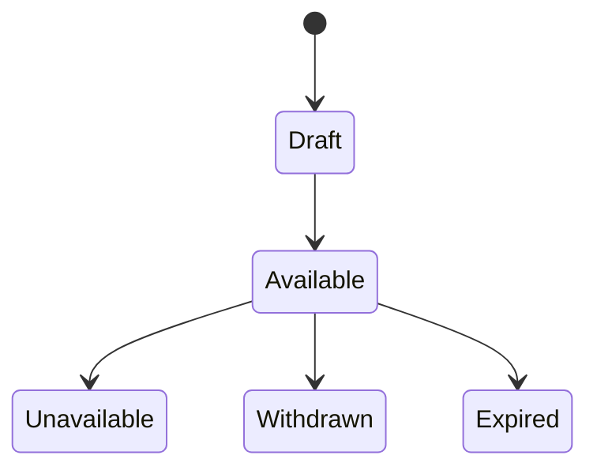
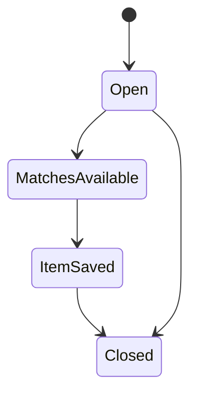

# Shipp — Expat Household Marketplace Specification
**Version (2.0) — Product & Systems Specification**

## 1. Overview

Leaving expatriates often need to dispose of useful household items quickly before relocation, while arriving expatriates face the cost and difficulty of furnishing a new home. **Shipp** addresses this gap through a multi-sided marketplace that connects available household items from leaving expatriates with the needs of arriving expatriates.

The Shipp capstone focuses on the **data and AI workflow behind this marketplace**. Structured marketplace records, third-party API data, and unstructured listing content such as images and descriptions are processed through a Spark-based data pipeline to create trusted data products for matching, analytics, and semantic retrieval.

Users interact with Shipp through a **Databricks App**. **Lakebase** stores current operational state such as listings, requests, saved items, and agent actions. An **AI Agent** retrieves structured candidate matches and relevant listing context through Databricks AI Search, explains recommendations, and performs controlled actions such as saving a selected item.

The P0 capstone demonstrates one complete workflow:

```text
Listing / Request
        ↓
Lakebase
        ↓
Incremental Ingestion
        ↓
Spark
Bronze → Silver → Gold
        ↓
Candidate Matches + Searchable Content
        ↓
AI Search + AI Agent
        ↓
Recommendation
        ↓
save_item()
        ↓
Lakebase
        ↓
Databricks App
```

**Technical objective:**

**Business Problem → Data → Pipeline → Intelligence → Action**

Production payments, escrow, full logistics execution, inspection operations, and shipping-partner portals are outside the P0 capstone scope.

## 2. Actors & Roles

Shipp has four main actors in the capstone.

| Actor                | Main Responsibility                                                                 | Data / System Interaction                                                 | Priority |
| -------------------- | ----------------------------------------------------------------------------------- | ------------------------------------------------------------------------- | -------- |
| **Donor**            | Creates and updates household-item listings and uploads images.                     | Databricks App → Lakebase `listings` + image storage                      | **P0**   |
| **Requester**        | Creates requests, views recommendations, and saves suitable items.                  | Databricks App → Lakebase `requests`; interacts with AI Agent             | **P0**   |
| **AI Agent**         | Retrieves trusted matches, explains recommendations, and performs approved actions. | READ: Gold + AI Search + Lakebase; WRITE: `saved_items`, `agent_activity` | **P0**   |
| **Shipping Partner** | Supports the broader pickup/delivery workflow.                                      | Simulated logistics/status data if required                               | **P1**   |

**Inspector** is part of the broader product vision but is outside the P0 capstone implementation.

### User Roles

Donor and Requester are roles of the same user population.

```text
USER
 ├── DONOR
 └── REQUESTER
```

A user may therefore act as both a Donor and a Requester at different times.

### System Flow

```text
Donor / Requester
        ↓
   Databricks App
        ↓
      Lakebase
        ↓
   Spark Pipeline
        ↓
 Trusted Gold Data
        ↓
      AI Agent
    READ + WRITE
```

### Capstone Priority

```text
P0: Donor, Requester, AI Agent
P1: Shipping Partner
P2: Inspector / full logistics workflow
```
## 3. Core Concepts & Terminology

### 3.1 Core Marketplace Concepts

* **Listing** — a household item posted by a Donor, including category, condition, location, availability, description, and images.

* **Request** — a Requester's need for a household item, including category, destination/location, and need-by date.

* **Candidate Match** — a scored pairing between a Request and an eligible Listing produced by the Spark pipeline.

* **Saved Item** — a Listing saved by a Requester after an AI Agent recommendation. This is the primary P0 Agent write action.

### 3.2 Capstone Technical Concepts

* **Gold Candidate Match** — the trusted Gold data product containing structured candidate-match results used by the AI Agent.

* **Searchable Listing Content** — cleaned Listing text and image-derived information prepared for semantic retrieval through Databricks AI Search.

* **Agent Action** — an auditable retrieval or write action performed by the AI Agent and recorded for operational tracking and analytics.

### 3.3 Outside P0 Scope

The broader Shipp product may later include:

* **Quote** — estimated logistics cost for a Candidate Match.
* **Order** — a confirmed Match and fulfillment request.
* **Shipment** — pickup, transportation, and delivery workflow.
* **Closure** — completion of the broader fulfillment process.

These concepts are outside the core P0 capstone implementation.

## 4. End-to-End Journey

The P0 capstone demonstrates one complete workflow from marketplace data to an AI-supported business action.

1. **List** — A Donor creates a Listing and uploads item images through the Databricks App.

2. **Request** — A Requester creates a Request describing the item they need.

3. **Store** — Listings and Requests are stored in Lakebase as operational application data.

4. **Ingest** — New and changed records, images, and external enrichment data enter the incremental data pipeline.

5. **Process** — Spark transforms the data through:

```text id="nph31q"
Bronze → Silver → Gold
```

* **Bronze:** raw source data.
* **Silver:** cleaned, validated, normalized, and enriched data.
* **Gold:** trusted Candidate Matches and searchable Listing content.

6. **Enrich & Match** — OpenRouteService provides distance and travel-time enrichment, and Spark generates Candidate Matches using category, availability, location, and relevance.

7. **Retrieve** — Databricks AI Search provides semantic retrieval over processed Listing descriptions and image-derived text.

8. **Recommend** — The AI Agent combines trusted Gold Candidate Matches with relevant AI Search context and explains the strongest recommendations.

9. **Act** — After user approval, the Agent saves the selected Listing to Lakebase and records the Agent action.

10. **Update** — The operational change is captured for analytics, and the Databricks App reflects the updated state.

### P0 Flow

```text id="gn2ofv"
Listing + Request
       ↓
    Lakebase
       ↓
Incremental Ingestion
       ↓
     Spark
Bronze → Silver → Gold
       ↓
Candidate Matches
   + Search Content
       ↓
   AI Search
       ↓
    AI Agent
       ↓
 Recommendation
       ↓
 User-approved Action
       ↓
    Lakebase
       ↓
Analytics + Databricks App
```

### Outside P0

The broader Shipp product may later include:

```text id="p25tb7"
Quote
→ Scheduling
→ Pickup / Inspection
→ Transportation
→ Delivery
→ Settlement
```

Payments, escrow, partner payouts, full shipment management, and inspection operations are outside the core capstone scope.

## 5. Functional Requirements

The capstone prioritizes one complete workflow and separates **P0 requirements** from optional product enhancements.

### 5.1 Item Posting — P0

The Donor must be able to:

* create a Listing;
* provide title, description, category, condition, location, and availability;
* upload one or more item images.

Listings are stored in **Lakebase**, while images are stored for downstream unstructured-data processing.

---

### 5.2 Requests — P0

The Requester must be able to:

* create one household-item Request;
* provide request text, category, location, and need-by date;
* view Candidate Matches produced for that Request.

P0 supports:

```text
One Request
→ Multiple Candidate Listings
```

Bundle optimization is outside P0.

---

### 5.3 Spark Matching Pipeline — P0

Spark must create trusted Candidate Matches using:

* category compatibility;
* availability;
* geographic distance;
* semantic relevance.

The result is served through:

```text
gold_candidate_matches
```

The AI Agent consumes this trusted output rather than performing matching directly from raw data.

---

### 5.4 Third-Party API Enrichment — P0

Shipp uses **OpenRouteService** to enrich Candidate Matches with:

* distance;
* estimated travel duration.

The integration must include:

* secure API authentication;
* raw-response preservation;
* retry/backoff;
* rate-limit handling;
* failure logging;
* route caching where useful.

Processed route data becomes an input to Candidate Match scoring.

---

### 5.5 Unstructured Data & AI Search — P0

Listing images and descriptions must be processed into searchable content.

```text
Images + Text
      ↓
Process / Clean
      ↓
Searchable Content
      ↓
Databricks AI Search
```

Search results must retain `listing_id` and relevant metadata for traceability.

---

### 5.6 AI Agent — P0

The Agent must support both **retrieval** and **write actions**.

#### Retrieval

The Agent must be able to:

* retrieve Candidate Matches from Gold;
* retrieve semantic Listing context from Databricks AI Search;
* check the current Listing state in Lakebase.

Core retrieval tools:

```text
get_candidate_matches()
search_listing_context()
get_listing_status()
```

#### Write

The primary business action is:

```text
save_item()
```

The Agent validates the current Listing state, writes the Saved Item to **Lakebase**, and records the action for audit and analytics.

---

### 5.7 Databricks App — P0

Shipp must provide a lightweight frontend deployed as a **Databricks App**.

The core UI must allow users to:

1. create/select a Request;
2. view Candidate Matches;
3. ask the AI Agent for a recommendation;
4. save a selected Listing;
5. view the updated saved state.

The App connects to the AI Agent and Lakebase.

---

### 5.8 Incremental Analytics — P0

Operational events must feed an incremental analytics pipeline.

Tracked events include:

* Listing creation/change;
* Request creation/change;
* Saved Item creation;
* Agent retrieval/write activity;
* Agent success/failure.

Key outputs include:

* Candidate Match count;
* save rate;
* Agent success rate;
* pipeline freshness.

---

### 5.9 Data Quality & Privacy — P1

The pipeline should validate:

* required identifiers;
* duplicates;
* valid status/category values;
* coordinates;
* availability dates;
* API failures.

PII should be minimized before data reaches Silver, Gold, AI Search, or Agent context.

---

### 5.10 Simple Quote Estimate — P1

After P0 is complete, Shipp may calculate:

```text
Estimated Transport Cost
=
distance_km × rate_per_km
```

This demonstrates business value from route enrichment.

Real payments, escrow, refunds, and settlement are outside the capstone.

---

### 5.11 Outside P0

The following remain future product features:

* bundle optimization;
* shipping-partner portal;
* complex scheduling;
* payment gateway and escrow;
* settlement and payouts;
* inspection workflow;
* disputes and refunds;
* notifications;
* identity verification;
* ratings;
* admin console;
* full shipment tracking.

## 6. Data Model

Shipp separates data into three storage areas:

| Area                      | Purpose                                         |
| ------------------------- | ----------------------------------------------- |
| **Lakebase**              | Current operational application state           |
| **Unity Catalog Volumes** | Images and other unstructured files             |
| **Delta / Unity Catalog** | Bronze, Silver, and Gold pipeline data products |

### 6.1 Operational Model — Lakebase

Lakebase is the system of record for current Shipp application state.

| Entity             | Key Fields                                                                                                                                                                        | Purpose                          |
| ------------------ | --------------------------------------------------------------------------------------------------------------------------------------------------------------------------------- | -------------------------------- |
| **User**           | `user_id PK`, `name`, `current_city`, `created_at`                                                                                                                                | User identity                    |
| **Role**           | `role_id PK`, `role_name`                                                                                                                                                         | Donor / Requester roles          |
| **User_Role**      | `user_id FK`, `role_id FK`                                                                                                                                                        | Supports multiple roles per user |
| **Listing**        | `listing_id PK`, `donor_id FK`, `title`, `description`, `category`, `condition`, `location`, `latitude`, `longitude`, `available_from`, `available_until`, `status`, `updated_at` | Current Listing state            |
| **Request**        | `request_id PK`, `requester_id FK`, `request_text`, `category`, `location`, `latitude`, `longitude`, `need_by_date`, `status`, `updated_at`                                       | Current Request state            |
| **Listing_File**   | `listing_file_id PK`, `listing_id FK`, `file_path`, `file_type`                                                                                                                   | Links Listings to stored images  |
| **Saved_Item**     | `saved_item_id PK`, `user_id FK`, `request_id FK`, `listing_id FK`, `saved_at`                                                                                                    | Agent's main business write      |
| **Agent_Activity** | `activity_id PK`, `user_id FK`, `tool_name`, `entity_id`, `action_status`, `created_at`                                                                                           | Agent audit and analytics        |

Donor and Requester are roles of the same user rather than separate user entities.

---

### 6.2 Images and Unstructured Files

Listing images are stored in a **Unity Catalog Volume**, while Lakebase stores only the file reference.

```text
Listing
   ↓
Listing_File
   ↓
Unity Catalog Volume
```

Example:

```text
/Volumes/shipp/raw/listing_images/
```

This preserves the relationship between the operational Listing and its unstructured source data.

---

### 6.3 Lakehouse Data Products

Bronze, Silver, and Gold are stored as Delta data products, not as Lakebase operational tables.

#### Bronze — Raw

Examples:

```text
bronze_listing_changes
bronze_request_changes
bronze_listing_files
bronze_external_listings
bronze_route_responses
bronze_vision_responses
```

Purpose: preserve raw source data and ingestion metadata.

#### Silver — Trusted

Examples:

```text
silver_listings
silver_requests
silver_routes
silver_listing_content
```

Purpose: validated, cleaned, normalized, privacy-safe data.

#### Gold — Business Ready

```text
gold_candidate_matches
```

Used by the AI Agent and Databricks App for structured recommendations.

```text
gold_listing_search_docs
```

Used as the source for Databricks AI Search.

```text
gold_marketplace_metrics
```

Used for analytics and KPI reporting.

---

### 6.4 Privacy Boundary

Sensitive operational information remains in Lakebase unless required downstream.

```text
Lakebase
Exact operational / PII data
        ↓
Data minimization
        ↓
Silver / Gold / AI Search
Business-required fields only
```

Phone numbers, emails, and unnecessary exact-address information should not enter Agent or AI Search context.

---

### 6.5 Read / Write Ownership

| Component          | Reads                                   | Writes                      |
| ------------------ | --------------------------------------- | --------------------------- |
| **Databricks App** | Lakebase operational state              | Listings, Requests          |
| **AI Agent**       | Gold, AI Search, current Listing status | Saved Items, Agent Activity |
| **Spark Pipeline** | CDF/files/API data                      | Bronze, Silver, Gold        |
| **AI Search**      | Search-ready Gold data                  | Search index                |
| **Analytics**      | Gold / incremental events               | Metrics and dashboards      |

The core boundary is:

```text
Lakebase = Operational Truth
Delta    = Pipeline / Analytical Data
Volumes  = Unstructured Files
```

## 7. State Machines

The P0 capstone uses only the states required for the core Listing → Match → Save workflow.

### 7.1 Listing State



* **Draft** — Listing created but not yet available for matching.
* **Available** — Listing can participate in Candidate Matching.
* **Unavailable** — Listing can no longer be offered.
* **Withdrawn** — Donor manually removes the Listing.
* **Expired** — Listing passes its availability deadline.

Saving a Listing records user interest but does **not** reserve or remove it from availability.

---

### 7.2 Request State



* **Open** — Request is waiting for suitable Listings.
* **MatchesAvailable** — the pipeline has produced Candidate Matches.
* **ItemSaved** — the Requester saved a recommended Listing.
* **Closed** — Request is no longer active.

### Core State Flow

```text
Request Open
    ↓
Candidate Matches Available
    ↓
Agent Recommendation
    ↓
Item Saved
```

Order, Shipment, Payment, Inspection, Refund, Dispute, and Reservation states belong to the broader Shipp product and are outside P0.


## 8. Fee Calculation Model

Pricing is a **P1 enhancement** used to demonstrate how routing data can create business value.

### 8.1 Route-Based Enrichment

OpenRouteService provides:

```text
distance_km
duration_min
```

for a Listing and Request location pair.

The processed route information is added to the trusted Candidate Match data produced by the Spark pipeline.

```text
Listing + Request
      ↓
OpenRouteService
      ↓
Spark Processing
      ↓
Candidate Match
```

### 8.2 Estimated Transport Cost

If P0 is complete, Shipp may calculate:

```text
Estimated Transport Cost
=
distance_km × rate_per_km
```

Example:

```text
12 km × 3 = 36
```

Pricing parameters should be configurable rather than hardcoded.

### 8.3 Agent Use

The AI Agent retrieves the processed distance and optional estimated cost from trusted Gold data rather than recalculating them from raw API responses.

### 8.4 Outside P0

The following are outside the core capstone scope:

* payment gateway;
* escrow;
* refunds;
* partner payouts;
* settlement;
* production invoicing;
* complex shipping/inspection fee models.

## 9. Non-Functional Requirements

The P0 capstone focuses on privacy, reliability, freshness, security, and observability.

### 9.1 Privacy

PII such as phone numbers, emails, and unnecessary exact-address information should remain in Lakebase and must not automatically propagate to Silver, Gold, AI Search, or Agent context.

```text
Lakebase
   ↓
PII Minimization
   ↓
Silver / Gold / AI Search
```

---

### 9.2 Security

API keys and credentials must not be hardcoded.

Secrets such as OpenRouteService and Vision API credentials should use Databricks-managed secrets/resources and least-privilege access.

---

### 9.3 Velocity

Shipp targets incremental processing with:

```text
Operational Change
       ↓
Incremental Pipeline
       ↓
Gold / Search
```

Target:

```text
< 60 seconds
```

from an eligible Listing/Request change to downstream retrieval availability under capstone demo conditions.

This latency must be measured during testing.

---

### 9.4 Reliability

The pipeline should avoid duplicate processing through:

* stable primary keys;
* deduplication;
* checkpoints;
* idempotent writes;
* duplicate `save_item()` validation.

Raw source data must remain available when downstream enrichment fails.

---

### 9.5 Auditability

Important data and Agent actions must remain traceable from source to outcome.

```text
Source
  ↓
Bronze
  ↓
Silver
  ↓
Gold
  ↓
Agent
  ↓
Action
```

Agent actions are recorded in `agent_activity`.

---

### 9.6 Observability

The project should monitor:

* records processed;
* rejected/duplicate records;
* API and Vision failures;
* Candidate Matches produced;
* pipeline freshness;
* Agent success/failure.

---

### 9.7 Outside P0

Advanced localization, multi-currency support, and production Shipping Partner integrations are outside the core capstone scope.

---

## 10. Edge Cases & Failure Policies

Only failures that affect the P0 Data Engineering and Agent workflow are handled.

### 10.1 No Candidate Match

If no eligible Listing exists, the Agent must return that no suitable match is available and must not invent a result.

---

### 10.2 Listing Becomes Unavailable

Before saving a recommended Listing, the Agent checks its current Lakebase state.

```text
Recommendation
      ↓
Check Listing Status
      ↓
Available? → save_item()
Not Available? → Reject
```

The result is recorded in `agent_activity`.

---

### 10.3 Duplicate Save

`save_item()` must prevent duplicate Saved Item records for the same user, Request, and Listing.

---

### 10.4 Image / Vision Failure

If image or Vision processing fails:

* preserve the original file;
* log the failure;
* retry where appropriate;
* do not fabricate extracted attributes.

---

### 10.5 Routing API Failure

Temporary OpenRouteService failures or rate limits should use retry/backoff and failure logging.

If routing data remains unavailable, the system must not invent distance or duration values.

---

### 10.6 Velocity SLO Miss

If processing takes longer than 60 seconds, the record should still be processed and the measured latency recorded as an SLO miss.

---

### 10.7 Outside P0

The following are future product concerns:

* payment/refund failures;
* delivery no-shows;
* shipment damage;
* inspection disputes;
* partner settlement;
* cross-border logistics.

## 11. Success Metrics & Evaluation

Shipp measures both **business usefulness** and **technical system quality**.

### 11.1 Marketplace Metrics

* **Candidate Match Rate** — percentage of Requests with at least one eligible Candidate Match.
* **Time to Match** — time from Request creation to Candidate Match availability.

These metrics show whether the pipeline produces useful marketplace results.

---

### 11.2 Pipeline Metrics

Track:

* records ingested;
* Silver accepted/rejected records;
* duplicates removed;
* API / Vision failures;
* Gold Candidate Matches produced;
* pipeline freshness.

### Velocity SLO

```text
retrieval_available_at
-
operational_change_at
< 60 seconds
```

This metric is used to prove the project's **Velocity** characteristic.

---

### 11.3 RAG / Retrieval Evaluation

Use a small labeled evaluation set of representative Requester questions and expected Listings.

Evaluate:

* retrieval relevance;
* correct Listing in top results;
* answer correctness;
* groundedness;
* Listing/source traceability;
* retrieval latency.

Optional P1 comparison:

```text
Keyword Search
      VS
Semantic / AI Search
```

This provides evidence that the selected retrieval approach improves recommendation quality.

---

### 11.4 Agent Metrics

Track:

* retrieval tool success/failure;
* `save_item()` success/failure;
* rejected invalid actions;
* duplicate-save prevention.

The Agent must correctly reject actions on unavailable Listings rather than writing invalid state.

---

### 11.5 Big Data Evidence

Shipp demonstrates two qualifying Big Data characteristics:

**Variety**

```text
Structured Lakebase data
+ JSON API responses
+ External data
+ Text descriptions
+ Images
+ Embeddings
```

**Velocity**

```text
Incremental processing
+ measured <60 second freshness target
```

**Volume is not claimed** as a qualifying characteristic.

Therefore:

```text
Qualifying Vs = Variety + Velocity
```
## 12. Assumptions, Dependencies & Open Questions

### 12.1 Scope Assumptions

* P0 supports domestic, single-item matching only.
* Payments, escrow, shipment execution, and inspection workflows are outside P0.
* `save_item()` is the primary Agent write action.
* Pricing is an optional P1 enhancement.
* **Variety + Velocity** are the two Big Data characteristics demonstrated.

---

### 12.2 Platform Dependencies

The implementation depends on workspace access to:

* Lakebase and Lakebase CDF;
* Unity Catalog and Volumes;
* Spark / Lakeflow;
* Databricks AI Search;
* model serving or the selected Vision capability;
* Databricks Apps.

Preview features must be verified in the bootcamp workspace before they become critical dependencies.

---

### 12.3 External Dependencies

**OpenRouteService**

* provides route distance and duration;
* requires a securely stored API key;
* is subject to service limits and availability.

**Vision Processing**

The team will select one implementable Vision approach:

```text
OpenAI Vision
OR
Qwen2-VL through an available endpoint
```

The chosen model and its output schema must be documented before implementation.

**External Marketplace Data**

Any Dubizzle or other marketplace data must have a permitted and documented ingestion method. The project must not depend on an unavailable public API.

---

### 12.4 Key Open Questions

Before implementation, the team must resolve:

1. Is Lakebase CDF available in the bootcamp workspace?
2. Which Vision model will be used?
3. What is the final Candidate Match scoring logic?
4. Can the pipeline meet the `<60 second` Velocity target?
5. What external marketplace data can be reliably and permissibly ingested?
6. What fallback will be used if a required Preview capability is unavailable?

# 13. Capstone Requirements & Technical Implementation

Shipp implements the required capstone capabilities through one end-to-end architecture:

```text
Data Sources
     ↓
Incremental Ingestion
     ↓
Spark
Bronze → Silver → Gold
     ↓
Trusted Data Products
   ↙             ↘
Analytics      AI Search
                  ↓
               AI Agent
             READ + WRITE
                  ↓
               Lakebase
                  ↓
            Databricks App
```

## 13.1 Requirement Mapping

| Requirement           | Shipp Implementation                                        |
| --------------------- | ----------------------------------------------------------- |
| **Spark Pipeline**    | Bronze → Silver → Gold processing with Spark                |
| **Third-Party API**   | OpenRouteService distance/duration enrichment               |
| **Lakebase**          | Operational Listings, Requests, Saved Items, Agent Activity |
| **Unstructured Data** | Listing images + descriptions → searchable content          |
| **Agent Retrieval**   | Gold Candidate Matches + Databricks AI Search               |
| **Agent Write**       | `save_item()` → Lakebase                                    |
| **Analytics**         | Lakebase CDF → Spark/Lakeflow → Delta metrics               |
| **Frontend**          | Streamlit                                                   |
| **Deployment**        | Databricks Apps                                             |
| **Big Data Vs**       | Variety + Velocity                                          |

---

## 13.2 Spark Data Pipeline

### Sources

```text
Lakebase Listings / Requests
Listing Images
External Marketplace Data
OpenRouteService
Vision Processing
```

### Ingestion

```text
Lakebase Changes → CDF
Images / Files   → Auto Loader
External Files   → Auto Loader
Routing Data     → API Job
```

### Medallion Processing

**Bronze**

Preserves raw:

* operational changes;
* files;
* external records;
* API responses;
* Vision responses;
* ingestion metadata.

**Silver**

Spark performs:

* validation;
* type casting;
* deduplication;
* normalization;
* PII minimization;
* API/Vision parsing;
* text cleaning.

**Gold**

Produces:

```text
gold_candidate_matches
gold_listing_search_docs
gold_marketplace_metrics
```

Consumers:

```text
Gold Candidate Matches → AI Agent / App
Search Docs            → AI Search
Marketplace Metrics    → Analytics
```

---

## 13.3 Third-Party API

Shipp uses **OpenRouteService** to calculate:

```text
distance
duration
```

between Listing and Request locations.

Integration requirements:

* API key stored securely;
* raw response preserved;
* retry/backoff;
* rate-limit handling;
* failure logging;
* route caching.

Processed results are normalized in Silver and used in Candidate Match scoring.

---

## 13.4 Lakebase

Lakebase stores current operational application state:

```text
users
roles
user_roles
listings
requests
listing_files
saved_items
agent_activity
```

Core boundary:

```text
Lakebase = Operational State
Delta    = Pipeline / Analytics
Volumes  = Unstructured Files
```

Operational changes feed downstream processing through CDF.

---

## 13.5 AI Search & Agent

### Retrieval

The Agent uses:

```text
get_candidate_matches()
search_listing_context()
get_listing_status()
```

to retrieve:

* structured Candidate Matches from Gold;
* semantic Listing context from Databricks AI Search;
* current operational Listing state from Lakebase.

### Write

The P0 write action is:

```text
save_item()
```

Flow:

```text
User Approval
     ↓
Agent validates Listing state
     ↓
save_item()
     ↓
Lakebase.saved_items
     ↓
agent_activity
```

The Agent does not write operational state directly to Gold.

---

## 13.6 Analytics Pipeline

```text
Lakebase Change
      ↓
CDF
      ↓
Unity Catalog Delta
      ↓
Spark / Lakeflow
      ↓
gold_marketplace_metrics
      ↓
Dashboard / SQL
```

Tracked events include:

* Listings;
* Requests;
* Saved Items;
* Agent actions;
* Agent success/failure;
* pipeline freshness.

---

## 13.7 Databricks App

Shipp uses:

```text
Frontend:   Streamlit
Deployment: Databricks Apps
```

The P0 interface supports:

1. create/select a Request;
2. view Candidate Matches;
3. ask the Agent for a recommendation;
4. save a Listing;
5. view the updated state.

Architecture:

```text
USER
 ↓
Databricks App
 ↓
AI Agent
 ├── Gold
 ├── AI Search
 └── Lakebase
        ↑
     save_item()
```

The application uses Databricks-managed resources and environment configuration rather than hardcoded credentials.

---

## 13.8 Big Data Characteristics

Shipp demonstrates:

### Variety

```text
Structured relational data
+ JSON API responses
+ External records
+ Text
+ Images
+ Embeddings
```

### Velocity

```text
Operational Change
      ↓
Incremental Pipeline
      ↓
Gold / AI Search
```

Target:

```text
< 60 seconds
```

from eligible operational change to downstream retrieval availability during capstone testing.

**Volume is not claimed.**

Therefore:

```text
Qualifying Vs = Variety + Velocity
```

---

## 13.9 Data Integration Summary

| Source            | Ingestion    | Processing     | Output                     | Consumer        |
| ----------------- | ------------ | -------------- | -------------------------- | --------------- |
| Lakebase          | CDF          | Spark          | Silver Listings/Requests   | Matching        |
| Images            | Auto Loader  | Vision + Spark | Searchable Listing Content | AI Search       |
| External Listings | Auto Loader  | Spark          | Silver External Listings   | Matching/Search |
| OpenRouteService  | API Job      | Spark          | Silver Routes              | Matching        |
| Silver Data       | Spark        | Match Scoring  | Gold Candidate Matches     | Agent/App       |
| Agent Actions     | Lakebase CDF | Spark/Lakeflow | Marketplace Metrics        | Analytics       |

---

## 13.10 Definition of Done

The capstone is complete when the team can demonstrate:

```text
New Listing / Request
        ↓
Lakebase
        ↓
Incremental Ingestion
        ↓
Bronze → Silver → Gold
        ↓
Candidate Match + Search Update
        ↓
Agent retrieves correct evidence
        ↓
Agent explains recommendation
        ↓
User requests save
        ↓
Agent writes to Lakebase
        ↓
CDF captures the action
        ↓
Analytics updates
        ↓
Databricks App shows new state
```

**Final technical narrative:**

> Shipp combines structured, API, external, and unstructured marketplace data through a Spark pipeline. Trusted Gold data and Databricks AI Search support an AI Agent that retrieves relevant evidence and performs a controlled write to Lakebase. A Databricks App demonstrates the complete workflow from new data to intelligent action.
